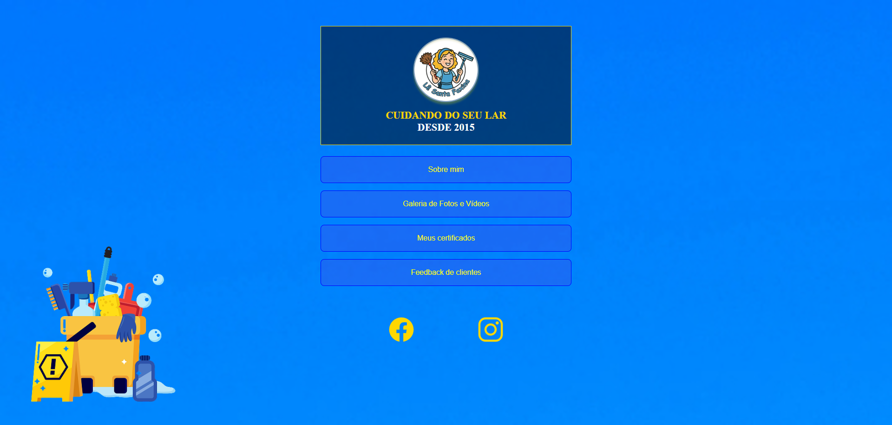

<h1 align="center"> Lê Santa Faxina </h1>

Projeto de um site para divulgação do trabalho de uma diarista

  <a href="#-tecnologias">Tecnologias</a>&nbsp;&nbsp;&nbsp;|&nbsp;&nbsp;&nbsp;
  <a href="#-projeto">Projeto</a>&nbsp;&nbsp;&nbsp;|&nbsp;&nbsp;&nbsp;
  <a href="#-layout">Layout</a>&nbsp;&nbsp;&nbsp;|&nbsp;&nbsp;&nbsp;
  <a href="#memo-licença">Licença</a>&nbsp;&nbsp;&nbsp;|&nbsp;&nbsp;&nbsp;

  

 

  

## 🚀 Tecnologias

Esse projeto foi desenvolvido com as seguintes tecnologias:

- HTML e CSS
- JavaScript
- Git e Github
- Figma

## 💻 Projeto

Este projeto é uma **galeria interativa de imagens e vídeos** para apresentar os serviços da empresa **Lê Santa Faxina**, com recursos como carrossel, zoom em fotos e vídeos, e design responsivo.

## :memo: Licença

Esse projeto está sob a licença MIT.

---

Feito com ♥ by Lucas Faria Costa(feryus963)
